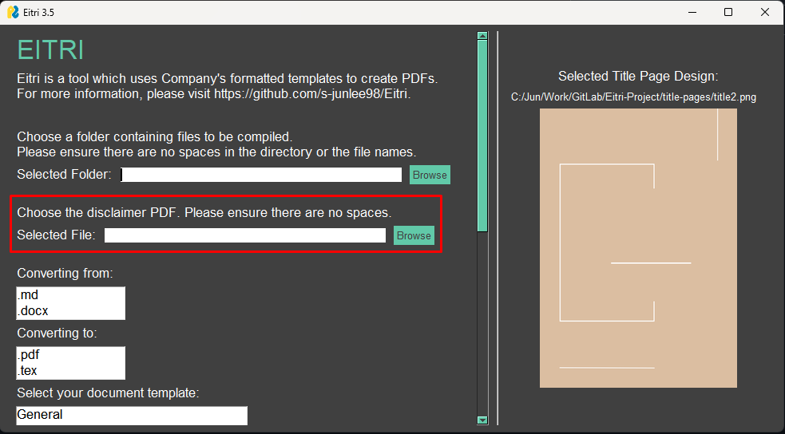
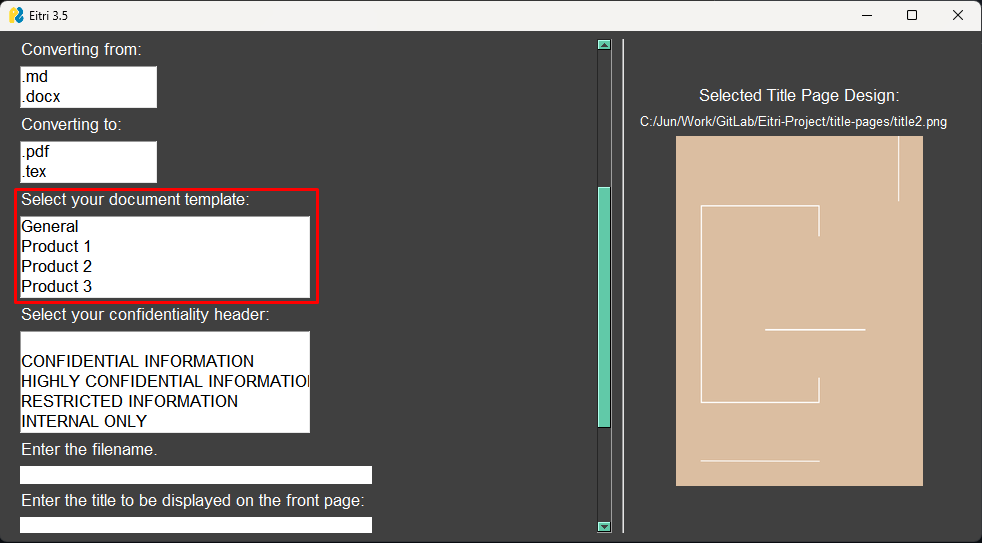

## Markdown to PDF Converter

Eitri is an executable (.exe) file which converts markdown (.md) and MS word (.docx) files into PDF (.pdf) or LaTeX files (.tex). The source code has been written in python.

This page explains:

1. How to setup Eitri to run correctly.
2. How to use Eitri to create a PDF.

### Requirements

Open the navigation tree on the left to download the latest Eitri.exe.

### How to Setup Eitri

To run Eitri, the following are required.

1. Eitri.exe.

**When you first run Eitri in your working environment, you may see alerts to install new packages - please install these. You'll only have to do this once. For convenience, *untick* the "Always show this dialogue" option (see screenshot). This will take a few minutes.**

### How to Pin Eitri to Start Menu

Once you download Eitri.exe, right-click on the file and select "Pin to start". This will create a shortcut to the Eitri.exe file from your start menu.

- **Pinning to Start Menu:** Select the file you wish to pin by clicking on it once. Then right-click on the file, and select "Pin to Start".
- **Unpinning from Start Menu:** Right-click on the tile in the start menu, then select "Unpin from Start".

**If you move the file to a different directory after adding the shortcut to the start menu,, the shortcut will stop working.**

### How to Use Eitri to Create a PDF

The following steps outline how to use Eitri.

1. Place all your .md or .docx files within a folder in the **C Drive** (the executable will not run from the G Drive). Ensure there are **no whitespaces in the directory path of this folder, as well as the filename.**
2. For markdown only: Place any images in the correct directory. It is recommended that you place them in the same folder as your markdown files.
3. Run Eitri. **Do not close the CMD window which pops up alongside the GUI.**
4. Locate the folder containing the .md/.docx and the images using *Browse*. Remember to not have a space in the directory or the file name.

5. Select the disclaimer PDF file. Consult the [Confidentiality Guide](https://docs.tradinghub.com/articles/Confidentiality_Guide/000-LandingPage.html) to ensure you have the correct disclaimer. If you are using a disclaimer with a variable (e.g. disclaimers which require you to specify the intended client name and address), please edit this at the end using Adobe Acrobat DC.

6. Select your input file type (either ".md" or ".docx").

7. Select your output file type (".pdf" or ".tex").

8. Choose the appropriate template. Product-specific templates has the product name on the front page.

9.  Choose the appropriate confidentiality header..

10. Enter the filename. This is what gets displayed in your file explorer. You can easily rename this later.

11. Enter the document title. Try to keep this concise. If you wish to insert a line break at a certain point, type "\linebreak" directly into the box.

12. Enter the relevant version number (e.g. 2023.2, V2). If the documentation does not belong to one certain version, leave the field blank.

13. Choose the title page design. Selecting a file displays a preview on the right-hand side of the interface.

14. Select *GENERATE DOCUMENT* to run the application.

**You can use the command window to read additional messages.**

### Generating a PDF from DOCX

- **If you are creating a new document in Word (.docx) format:**, please read through and use the Eitri Word Template. Then, simply follow the steps in "How to Use Eitri to Create a PDF".
- **If you have an existing document which you have already created** and would like to format the Word document correctly, follow the series of steps below.

#### Formatting an Existing Word Document for Conversion

1. Remove any title pages. These are automatically generated when you run Eitri. You will be able to input the title.
2. Remove any Table of Contents. These are automatically generated when you run Eitri.
3. Remove any headers (e.g. "Confidential" written at the top). Eitri provides you with a selection of header wordings.
4. Ensure that your headings and subheadings are properly formatted. Select the heading, and choose a heading style in *Home/Styles*. **Heading 1** is a part heading, **Heading 2** is a chapter heading, and **Heading 3 - Heading 5** are subheadings. 

5. Ensure that your images are correctly captioned. To to this, right click on the image and select "Edit Alt Text". The text contained here appears as the image caption in the PDF when you convert it using Eitri.
6. Use Eitri to convert the Word file into a formatted PDF by following the steps in "How to Use Eitri to Create a PDF". 

**Please contact the s.junlee98@gmail.com team for assistance.**

